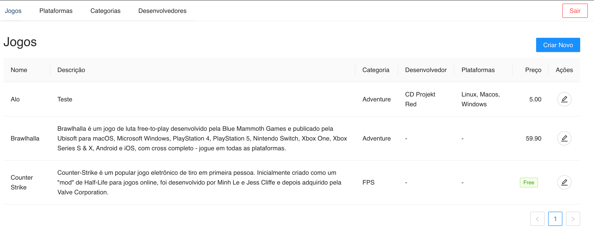

# icgames :video_game:

Trabalho final da matéria Programação em Ambiente WEB II - UFMT

O trabalho em questão é uma aplicação bem simples com CRUDs de entidades relacionados a um E-commerce de games. Foi feito pensando em grandes E-commerces como a [Steam](https://store.steampowered.com/?l=portuguese), [Epic Games](https://store.epicgames.com/pt-BR/) e [GOG Games](https://www.gog.com).

---

## Linguagens de programação utilizadas:

- [Typescript](https://www.typescriptlang.org)
- [Python](https://www.python.org)

## Frameworks utilizados:

- [Django Rest Framework](https://www.django-rest-framework.org) (backend)
- [React](https://pt-br.reactjs.org) (frontend)

---

## :information_source: Como rodar o projeto

### Clonar o repositório

```bash
git clone https://github.com/felipe-jm/icgames
```

### Passos para rodar o **backend**

```bash
cd icgames/backend

python3 -m venv env
source env/bin/activate

pip install django
pip install djangorestframework
pip install djangorestframework-simplejwt
pip install psycopg2
pip install dj_rest_auth
pip install django-cors-headers
pip install django-allauth

python manage.py migrate

python manage.py runserver
```

### Acessar **admin do Django**

```bash
# Criar superuser
python manage.py createsuperuser --email admin@admin.com --username admin

# Entrar em http://localhost:8000/admin, loggar no admin e brincar com os cruds
```

## Passos para rodar o frontend

```bash
cd frontend

npm i

npm run dev
```

---

## Utilização da aplicação

Ao estar rodando tanto o backend quanto o frontend, pode-se cadastrar-se um novo usuário usando a tela de cadastro e logo após realizar o login.



Feito por Felipe Jung :blush: <a href="https://www.linkedin.com/in/felipe-jung/">Meu contato</a>
